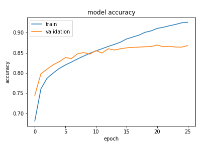
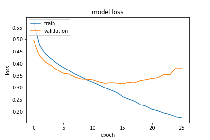
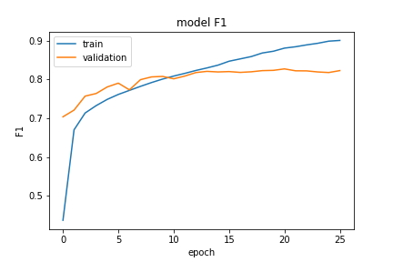

# Semantic Question Matching
Semantic Question Matching with Deep Learning Keras - achieving 0.81 `F1 score`, and 0.86% `Accuracy` on `validation set`.

This is Keras implementation of [Semantic Question Matching with Deep Learning](https://engineering.quora.com/Semantic-Question-Matching-with-Deep-Learning)

There was also [Kaggle competition](https://www.kaggle.com/c/quora-question-pairs/data).

## Dataset

You can download data from: http://qim.fs.quoracdn.net/quora_duplicate_questions.tsv 
Dataset info: https://data.quora.com/First-Quora-Dataset-Release-Question-Pairs 
Test data: https://www.kaggle.com/c/quora-question-pairs/download/test.csv 

## Word embedding
300 dimensional [Fasttext word embeddings](https://s3-us-west-1.amazonaws.com/fasttext-vectors/wiki.en.vec) are used.

## Data Cleaning
Not much data cleaning was done.
1. all words are converted into lower case
2. removing punctuations
```
def clean(input):
    input = input.lower()
    return re.sub('[!@#.,/$%^&*\(\)\{\}\[\]-_\<\>?\'\";:~`]',' ',str(input))
```

## Model : Shared Bi-LSTM model
 
`Total params`: 1,436,161

Model architecture:


### Result on validation dataset:

```
{
    "acc": 0.8671778383126448,
    "f1": 0.8139558653710002,
    "loss": 0.3984556962085661,
    "precision": 0.8089975262230763,
    "recall": 0.8332188677262942
}
```

### Train and val accuracy



### Train and val loss



### Train and val f1 score



# Running code

You need to create `Python 3.6` environment:
```
conda env create -f environment.yml
conda activate deep-learning
```


Now you can run these commadns below to download the word embeddings file and dataset:
```
cd scripts
./download_files.sh
```

This will create 2 folders and will download corresponding files into those directories:
```
project_dir/word_embeddings/wiki.en.vec
proejct_dir/dataset/quora_duplicate_questions.tsv
```

You can install tensorflow-server-model as described in [this blog post](https://towardsdatascience.com/deploying-keras-models-using-tensorflow-serving-and-flask-508ba00f1037):

You need to export saved Keras model*.h5* file into Tensorflow format
You need to run this script:
```
cd scripts
conda activate deep-learning
python export_saved_model.py
```

Now you can start Flask app and tensorflow-server-model:

```
cd scripts
conda activate deep-learning
python start-flask-and-tensorflow_model_server.py
```

Now in anohter terminal window you can run this script for testing a question pair semantic similarity:
```
cd flask_server
conda activate deep-learning
python flask_sample_request.py -q1="What is 2 + 3 ?" -q2="What is 2 + 3 ?"
```

**Note**: The first request response time will take around ~6 min, as the Flask app will load word embeddings into memory (which is around 6.2 GB), but all other requests will return results in milliseconds.

## Generating test results for Kaggle

You can compute probabilities for [`Quora Question Pairs`](https://www.kaggle.com/c/quora-question-pairs#evaluation) test dataset using `Evaluating-on-test-data.ipynb` notebook.

## Sample results
The model can differentiate even very minor changes which causes big semantic meaning:
```
python flask_sample_request.py -q1="What is 2 + 3 ?" -q2="What is 2 + 3 ?"
args {'question1': 'What is 2 + 3 ?', 'question2': 'What is 2 + 3 ?'}
{
  "predictions": [
    [
      0.779492
    ]
  ]
}

```

Now changing variabls `2` and `3`, still model can predict questions as semantically duplicate:

```
python flask_sample_request.py -q1="What is 2 + 3 ?" -q2="What is 3 + 2 ?"
args {'question1': 'What is 2 + 3 ?', 'question2': 'What is 3 + 2 ?'}
{
  "predictions": [
    [
      0.779492
    ]
  ]
}

```

Now changing `+` to `*`, and now the model identifies questions as semantically `different` :

```
python flask_sample_request.py -q1="What is 2 + 3 ?" -q2="What is 3 * 2 ?"
args {'question1': 'What is 2 + 3 ?', 'question2': 'What is 3 * 2 ?'}
{
  "predictions": [
    [
      0.0753584
    ]
  ]
}

```

Similarly, changing `+` to `-`, and now the model identifies questions as semantically `

```
python flask_sample_request.py -q1="What is 2 + 3 ?" -q2="What is 3 - 2 ?"
args {'question1': 'What is 2 + 3 ?', 'question2': 'What is 3 - 2 ?'}
{
  "predictions": [
    [
      0.136308
    ]
  ]
}

```
