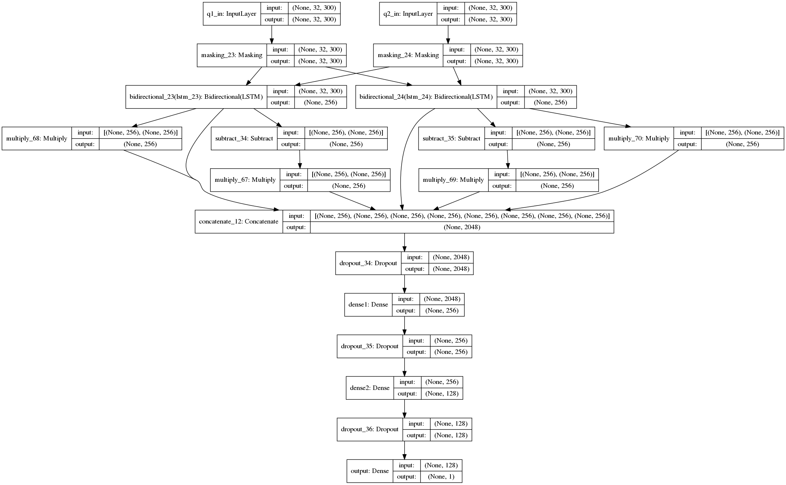

# semantic-question-matching
Semantic Question Matching with Deep Learning Keras

This is Keras implementation of [Semantic Question Matching with Deep Learning](https://engineering.quora.com/Semantic-Question-Matching-with-Deep-Learning)

There was also [Kaggle competition](https://www.kaggle.com/c/quora-question-pairs/data).

## Dataset

You can download data from: http://qim.ec.quoracdn.net/quora_duplicate_questions.tsv 
Dataset info: https://data.quora.com/First-Quora-Dataset-Release-Question-Pairs 


## Word embedding
300 dimensional [Fasttext word embeddings](https://s3-us-west-1.amazonaws.com/fasttext-vectors/wiki.en.vec) are used.

## Data Cleaning
Not much data cleaning was done.
1. all words are converted into lower case
2. removing punctuations
```
def clean(input):
    input = input.lower()
    return re.sub('[!@#.,/$%^&*\(\)\{\}\[\]-_\<\>?\'\";:~`]',' ',str(input))
```

## Model


### Shared Bi-LSTM model
`Total params`: 1,436,161

Model description:




Result on test dataset:

```
{
    "acc": 0.8654464506407112,
    "f1": 0.8157053697442407,
    "loss": 0.36335550133261446,
    "precision": 0.7982342198966548,
    "recall": 0.8497477165107057
}
```
